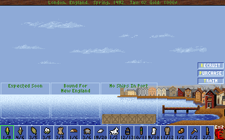

# Extract text from classic game screenshots with exact image-matching

A script to extract text out of low resolution screenshots from classic 
DOS games. 

Inputs: 
 - a set of character images 
 - a screenshot of a classic game

Output:
 - a sequence of characters based on the images provided
 
Two approaches are implemented: 
 - Exact pixel matching: we loop over all coordinates in the screenshot and, at each 
   coordinate, try  all the character images pixel-by-pixel. If multiple character 
   images match, use the largest one and advance by the width of that image. 
   100% accuracy!
 - Sliding-window template matching: a sliding window of the maximum size of the 
   character images runs over the screenshot. In each window, all the character
   images are matched using the opencv template matching function. The one with 
   the best match (the least deviation) is taken, and the sliding window as advanced
   by the width of the matching char. 99% accuracy.

 
## Example

This repository contains example character images and a screenshot for the 
game Colonization from Sid Meier (1994). The goal here is to extract the 
prices of goods from the screenshot below:

Using the command:

    python3 extract-text-with-image-pixel-matching.py -s img/opening_003.png --ystart 194 img/char_* 

we will start scanning the screenshot for all the characters specified by the glob pattern, starting 
at Y coordinate 194. The result is the following text

    img/opening_003.png 1/9 4/6 3/5 3/5 3/5 1/6 3/6 19/20 1/2 12/13 10/11 9/10 11/12 1/2 1/2 2/3

## How to extract text characters from the screnshot of any other classic game

 - Take screenshots and extract all character images similar to the ones provided here. Files 
   should be named "char_[REPORTED CHAR].png", e.g. "char_8.png" will later be printed as "8"
 - adapt char_name_translations in the script code to match your filenames
 - play around with `ystart`, `yend` coordinates, maybe add more images, and try both provided 
   methods
